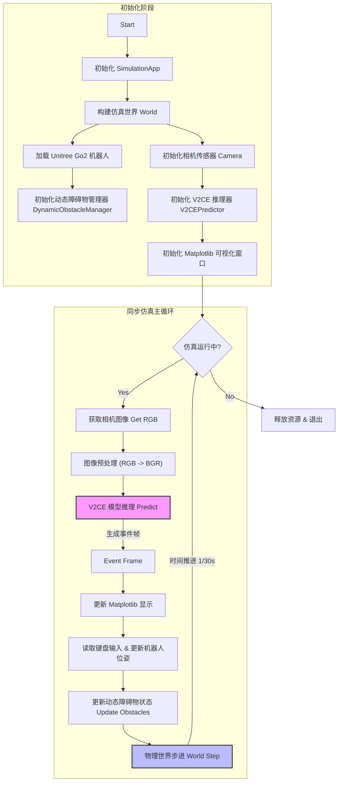

## 快速开始(这个分支服务于ubuntu)
```shell
# ssh：
ssh fishyu@162.105.195.38
# 启动vnc
x11vnc -display :0 -forever -shared -rfbport 5900
# 克隆仓库
clone https://github.com/DawnTilDusk/v2ce.git
# 进入虚拟环境
conda create -n v2ce python=3.10
conda activate v2ce
# 安装依赖
pip install -r requirements.txt
```

### gpu的启用
**测试是否能正常使用gpu**
```shell
python -c "import torch; print(torch.__version__); print(torch.cuda.is_available()); print(torch.version.cuda)"
```
返回类似以下即成功：
```shell
2.0.0+cu118
True
11.8
```

**或者使用：**
```shell
nvidia-smi
```
### 集成于一个主脚本的事件相机模拟测试
```shell
export DISPLAY=:0 && $ISAACSIM_PYTHON_EXE robot_test/go2_v2ce_sync.py
```

#### 架构说明：
1. 同步机制 ：
   
   - 架构中最关键的是 推理(L) 与 物理步进(Q) 的串行关系。
   - 代码显式等待 V2CE 模型推理完成生成 Event Frame 后，才调用 world.step() 推进物理时间。这确保了无论推理耗时多久，仿真世界的时间流逝始终是精确的 1/30 秒，避免了“慢动作”或“跳帧”现象。
2. 模块分工 ：
   
   - World/Robot : 负责物理仿真环境和机器人本体。
   - V2CEPredictor : 负责视觉算法，将普通 RGB 图像转换为事件相机风格的特征图。
   - DynamicObstacleManager : 独立管理环境中的动态物体，与机器人解耦。
   - Visualization : 使用 Matplotlib 实时展示算法效果（因为 Isaac Sim 的 OpenCV GUI 受限）。




---

## archive里面的一些文件的启动方式(有一些仍然是只兼容windows)
- 摄像头转事件相机：
```powershell
export DISPLAY=:0 && python v2ce_online.py --device cuda --camera_index 0 --interval 1 --fps 30 --ceil 10 --upper_bound_percentile 98
```

- 视频转事件相机：
```powershell
export DISPLAY=:0 && python v2ce_online.py --device cuda --input_video_path test.mp4 --interval 1 --fps 30 --ceil 10 --upper_bound_percentile 98

export DISPLAY=:0 && python v2ce_online-v3.py --device cuda --input_video_path test.mp4 --interval 3 --fps 30
```
- 服务端与客户端解耦运行可视化模拟事件相机：
```powershell
cd C:\isaac-sim\
.\python.bat C:\Users\JerryY1\Desktop\v2ce\integrate\server-v2.py

cd C:\Users\JerryY1\Desktop\v2ce
python integrate/client.py 
```

#### 参数说明
- --device [cpu|cuda]，默认 cpu：推理设备，需与已安装的 PyTorch 版本匹配。参考 [v2ce_online.py:L263](file:///c:/Users/Notebook/Desktop/v2ce/v2ce_online.py#L263) 与 [get_trained_mode](file:///c:/Users/Notebook/Desktop/v2ce/v2ce_online.py#L29-L34)。
- --camera_index [int]，默认 0：摄像头索引；当不提供 --input_video_path 时使用该索引打开视频源。参考 [v2ce_online.py:L264-L285](file:///c:/Users/Notebook/Desktop/v2ce/v2ce_online.py#L264-L285)。
- --input_video_path [path]，默认空：输入视频路径；与 --camera_index 二选一。参考 [v2ce_online.py:L265-L285](file:///c:/Users/Notebook/Desktop/v2ce/v2ce_online.py#L265-L285)。
- --model_path [path]，默认 ./weights/v2ce_3d.pt：模型权重路径。参考 [v2ce_online.py:L266,L280](file:///c:/Users/Notebook/Desktop/v2ce/v2ce_online.py#L266)。
- --height [int]，默认 260：预处理统一高度（按高缩放保持宽高比），影响体素尺寸。参考 [preprocess_pair](file:///c:/Users/Notebook/Desktop/v2ce/v2ce_online.py#L36-L46)、[v2ce_online.py:L300-L311](file:///c:/Users/Notebook/Desktop/v2ce/v2ce_online.py#L300-L311)。
- --width [int]，默认 346：中心裁剪推理宽度，仅在 center 推理路径使用。参考 [infer_center_image_unit](file:///c:/Users/Notebook/Desktop/v2ce/v2ce_online.py#L49-L55)、[v2ce_online.py:L301](file:///c:/Users/Notebook/Desktop/v2ce/v2ce_online.py#L301)。
- --fps [int]，默认 30：事件时间步相关参数，影响事件帧生成与采样。参考 [v2ce_online.py:L269,L282,L308-L309](file:///c:/Users/Notebook/Desktop/v2ce/v2ce_online.py#L269)。
- --ceil [int]，默认 10：事件帧像素值裁剪上限，控制可视化对比度。参考 [make_event_frame](file:///c:/Users/Notebook/Desktop/v2ce/v2ce_online.py#L57-L108)、[write_event_frame_video](file:///c:/Users/Notebook/Desktop/v2ce/v2ce_online.py#L220-L260)。
- --upper_bound_percentile [int]，默认 98：可视化归一化的百分位上界，抑制异常高值。参考 [v2ce_online.py:L241-L247,L308-L309](file:///c:/Users/Notebook/Desktop/v2ce/v2ce_online.py#L241-L247)。
- --interval [ms]，默认 150：两帧配对处理的时间间隔，控制在线推理频率。参考 [v2ce_online.py:L298-L311](file:///c:/Users/Notebook/Desktop/v2ce/v2ce_online.py#L298-L311)。
- --vis_keep_polarity [bool]，默认 True：事件帧可视化时是否保留极性分离（正/负）。参考 [v2ce_online.py:L57-L108,L273,L308-L309](file:///c:/Users/Notebook/Desktop/v2ce/v2ce_online.py#L57-L108)。
- -l/--log_level [debug|info|warning|error]，默认 info：日志等级。参考 [v2ce_online.py:L274-L279](file:///c:/Users/Notebook/Desktop/v2ce/v2ce_online.py#L274-L279)。

#### 进阶用法
- CPU 摄像头（更清晰显示负/正事件分离）：
  python v2ce_online.py --device cpu --camera_index 0 --interval 150 --fps 30 --ceil 10 --upper_bound_percentile 98 --vis_keep_polarity true -l debug
- CPU 视频（提高可视化亮度并关闭极性分离）：
  python v2ce_online.py --device cpu --input_video_path test.mp4 --interval 100 --fps 30 --ceil 15 --upper_bound_percentile 95 --vis_keep_polarity false
- GPU 摄像头（分辨率与中心裁剪调整）：
  python v2ce_online.py --device cuda --camera_index 0 --height 300 --width 320 --interval 120 --fps 60 --ceil 12 --upper_bound_percentile 97
- GPU 视频（更高帧率的事件生成）：
  python v2ce_online.py --device cuda --input_video_path test.mp4 --fps 60 --interval 100 --ceil 12 --upper_bound_percentile 97 --vis_keep_polarity true
- 日志等级：在调试时使用 -l debug 以查看细节；部署时建议 info 或 warning。


### Local Motion
```sh
cd ~
git clone https://github.com/isaac-sim/IsaacLab.git
cd IsaacLab
# 切换到与项目兼容的版本（README提到是2.1.0）
git checkout v2.1.0

conda activate v2ce

# 安装核心库 (Core)
pip install -e source/isaaclab
pip install torch==2.5.1 torchvision==0.20.1 torchaudio==2.5.1
pip install numba==0.63.1 llvmlite==0.46.0

# 安装资产库 (Assets)
pip install -e source/isaaclab_assets

# 安装任务库 (Tasks - 包含示例环境)
pip install -e source/isaaclab_tasks

# 安装 RL 接口 (如果你要做强化学习)
pip install -e source/isaaclab_rl
/home/fishyu/anaconda3/envs/v2ce/bin/pip install rsl-rl-lib==2.3.1

pip check
python -c "import isaacsim; import omni.isaac.lab; print('Success!')"

export DISPLAY=:0
bash
export ISAAC_SIM_PATH="/media/fishyu/6955024a-ed66-4a86-b94a-687c51c28306/fishyu/luoac/isaacsim" && source $ISAAC_SIM_PATH/setup_conda_env.sh && python simple_go2_teleop.py

export DISPLAY=:0 && ./run_teleop.sh simple_go2_teleop.py
export DISPLAY=:0 && ./run_teleop.sh --headless
```
```py
# env中硬编码
# [FIX] 动态修复 USD 路径
# 如果 Nucleus 路径解析失败 (None/...), 强制替换为有效的 HTTP URL
usd_path = UNITREE_GO2_CFG.spawn.usd_path
if usd_path.startswith("None") or not usd_path.startswith("http"):
    print(f"[WARN] Invalid USD path detected: {usd_path}")
    # 使用 NVIDIA 官方 S3 镜像
    fixed_path = "http://omniverse-content-production.s3-us-west-2.amazonaws.com/Assets/Isaac/4.5/Isaac/Robots/Unitree/Go2/go2.usd"
    print(f"[INFO] Patching USD path to: {fixed_path}")
    UNITREE_GO2_CFG.spawn.usd_path = fixed_path

# 主入口硬编码
# ---------------------------------------------------------------------------
# [FIX] 手动设置 Nucleus 服务器路径
# 解决 NUCLEUS_ASSET_ROOT_DIR 为 None 导致的 USD 加载失败问题
# ---------------------------------------------------------------------------
settings = carb.settings.get_settings()
if settings.get("/persistent/isaac/asset_root/cloud") is None:
    # 使用 NVIDIA 官方提供的 S3 镜像地址作为后备
    fallback_url = "http://omniverse-content-production.s3-us-west-2.amazonaws.com/Assets/Isaac/4.5"
    print(f"[INFO] Setting Nucleus asset root to fallback URL: {fallback_url}")
    settings.set("/persistent/isaac/asset_root/cloud", fallback_url)
    
```